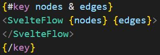
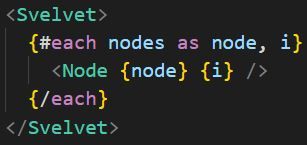

# Proof of concepts for Trajectory-generator in Svelte Flow & Svelvet

For my internship project, I am tasked with developing a graphical user interface (GUI) for representing theoretical trajectories of medical conditions. These trajectories will be showcased in an interactive diagram editor. The project is built using SvelteKit, and to implement the interactive diagram, I am exploring two potential packages: [Svelte Flow](https://svelteflow.dev/api-reference) and [Svelvet](https://svelvet.mintlify.app/introduction).

In this repository, I have created a proof of concept for the GUI design using both Svelte Flow and Svelvet. After successfully incorporating both packages, I will document and compare their features.

**Disclaimer:** These differences are likely not an exhaustive list, but rather the distinctions I observed while searching for the specific features required for my GUI.

**Second Disclaimer:** This review is not conducted based on an equal investment of time in both packages. Although I didn't meticulously track the time spent on each, my estimation is that I devoted approximately twice as much time to exploring Svelte Flow compared to Svelvet. It's important to note that these packages share similarities, and not all the aspects I experimented with are covered in this review.

| Feature                                      | Svelte Flow | Svelvet |
| -------------------------------------------- | ----------- | ------- |
| Rerendering of only one Node                  |             | X       |
| Resizing of nodes                             | X           | X       |
| EdgeDrop                                     | X           | X       |
| Drag & Drop                                  | X           | X       |
| Proximity Connection of edges                 | X           |         |
| Change the viewport based on selected node    | X           |         |
| Interactive minimap                          | X           | X       |

## Renderning of only one Node

In the case of SvelteFlow, this is not applicable. Currently, to enable interactivity in my diagram, I must utilize the key-expression, triggering a rerender of the entire diagram each time the lists of nodes and edges change.

On the other hand, with Svelvet, there is no need to pass your lists as properties. The main Svelvet component acts as a wrapper around the nodes you intend to render.

## Resizing

Both the [resizing component in Svlete Flow](https://svelteflow.dev/api-reference/components/node-resizer) and [Svelvets's resizing component](https://svelvet.mintlify.app/components/resizer) can be applied to a custom node to enable dynamic resizing. However, in Svelvet, you also have the capability to change the rotation of the node, a feature not available in Svelte Flow. It's important to note that to utilize the resizer component in Svelvet, you must specify an initial size for the node, and the width and height of the root-level HTML element should be defined as 100%.

## EdgeDrop

This is a desired feature I aim to implement, enabling users to drag a handle of their choice to any location in the diagram. Upon releasing the handle, a new node will be created.

In Svelte Flow, you can utilize the onconnectend and onconnectstart properties on the main SvelteFlow component to achieve this functionality.

For EdgeDrop in Svelvet, you can use the on:edgeDrop property on the main Svelvet component.

## Drag&Drop

In Svelte Flow, you have the flexibility to create a custom menu of draggable items, with each item featuring the `on:dragstart` property. Subsequently, you can leverage the `on:dragover` and `on:drop` properties on the SvelteFlow component to position the draggable item within your diagram.

Conversely, in Svelvet, there is a pre-built component called Drawer. This component allows you to style a node entirely from scratch and enables you to drop it wherever it best fits in your layout. However, in my current testing, I seem to have an issue with the Drawer. When I make use of the Drawer, it appears that the Drawer creates its own diagram flow where the node will be placed when dropped. This poses an issue because it results in the creation of two diagram flows that overlap each other.

## Proximity Connect

This feature enhances the user experience when utilizing drag&drop. The objective is to suggest a connection to a possible connection from another node when a node, where not all connections are made yet, comes within a certain range.

This functionality is achievable in Svelte Flow through the use of properties on the main component: `on:nodedrag` and `on:nodedragstop`.

## Change the viewPort based on the selected node

This feature came to my attention as I experimented with various functionalities in Svelte Flow. In Svelte Flow, you have access to several hooks, such as `useSvelteFlow()`. This hook provides access to a variety of functions, including `fitView`. This function operates similarly to the property on the main component of both Svelte Flow and Svelvet. Additionally, you can enhance this function by appending a parameter of options, allowing you to specify a particular node, for example. When you do so, the viewport of the diagram adjusts to fit that specific node.

## Interactive minimap

Each package includes a minimap to provide users with an overview of the nodes within the diagram. Although both minimaps are interactive, they have distinct features.

In Svelte Flow, the minimap cannot be panned using a touchpad, posing a limitation, particularly when working without a mouse. Conversely, Svelvet's minimap is navigable via a touchpad, but users must decide whether to utilize the touchpad or the mouse. Both minimaps allow customization of node colors that are visible, with Svelte Flow offering the additional capability to have different colors for each node type. Additionally, both minimaps support zooming in and out.

# Conclusion

In my current experience with both frameworks, I find Svelte Flow to be my preferred choice. Not only does it offer more features, but its documentation is also more comprehensive. The abundance of examples on their website provided valuable insights into effectively utilizing the package. Fortunately, my familiarity with Svelte Flow allowed me to navigate through the shortcomings of the Svelvet documentation. Additionally, I appreciate the more logical implementation of edges in Svelte Flow. While my opinion may be biased due to using an extra package, [elkjs](https://github.com/kieler/elkjs), for node display in my proof of concepts, I found that Svelte Flow is compatible with such integrations.